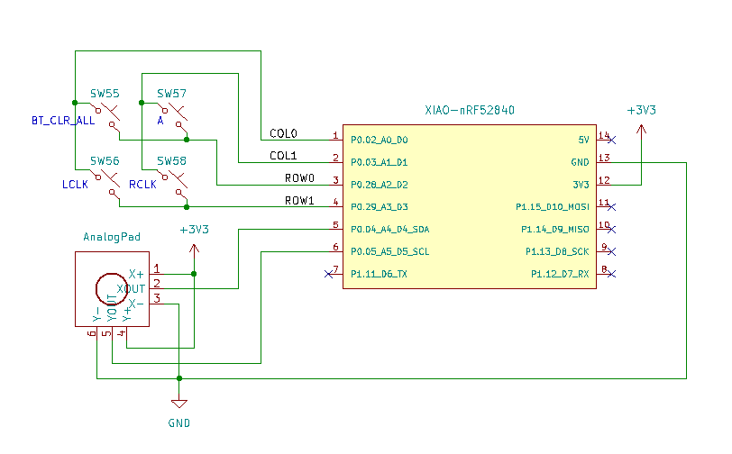

# ZMK sample project for zmk-analog-input-driver

This project is for checking built-in AD-Converter using badjeff's [zmk-analog-input-driver](https://github.com/badjeff/zmk-analog-input-driver).

- board: seeeduino_xiao_ble (XIAO nRF52840)
- shield: analog-input
- modules: https://github.com/badjeff/zmk-analog-input-driver

## Connection to XIAO nRF52840


## Local Build
### Prerequisites
- ZMK [Native Setup](https://zmk.dev/docs/development/local-toolchain/setup/native)
- [cyme](https://github.com/tuna-f1sh/cyme) (for flashing firmware)

### Setup
```
# clone this repo
cd ~/Downloads
git clone git@github.com:hidsh/zmk-analog-input.git

# cd to your `zmk/app` folder
cd PATH/TO/zmk/app

# create a symlink from makefile
ln -s ~/Downloads/zmk-analog-input/analog-input.mk ./Makefile
```

### Build
```
cd PATH/TO/zmk/app

# just `make` to build/flash firmware
make
```

## AD-Channels

You would specify the channels in the [overlay](https://github.com/hidsh/zmk-analog-input/blob/master/boards/shields/analog-input/analog-input.overlay).
For XIAO-BLE(nRF52840), `<&adc #>` means as below:

|&adc #|GPIO|XIAO-BLE|
|---:|---:|:---|
|0|P0.02|#1 D0|
|1|P0.03|#2 D1|
|2|P0.04|#5 D4|
|3|P0.05|#6 D5|
|4|P0.28|#3 D2|
|5|P0.29|#4 D3|
|6|P0.30|(LED GREEN)|
|7|P0.31|(BAT+)|

## Adjusting the input

You may need to adjust some [properties](https://github.com/hidsh/zmk-analog-input/blob/e7986f12a1f4c9f46df2857d47486299a9e3ba99/boards/shields/analog-input/analog-input.overlay#L54-L58) depends on your thumb stick:
|prop|desc|
|---|:---|
|`mv-mid`| neutral AD value |
|`mv-min-max` | available range |
|`mv-deadzone` | deadzone |
|`scale-multiplier` | to increase count |
|`scale-divisor` | to decrease count |


At first, enable the following configs in [analog-input.conf](boards/shields/analog-input/analog-input.conf):
```
CONFIG_ANALOG_INPUT_LOG_LEVEL_DBG=y
CONFIG_ANALOG_INPUT_LOG_DBG_RAW=y
CONFIG_ANALOG_INPUT_LOG_DBG_REPORT=y
```

Next, rebuid/flash new firmware.

Then, check the raw values from the zmk to determine the properties mentioned above.

I use [tio](https://github.com/tio/tio) and my [trivial filter](https://gist.github.com/hidsh/a3ee73315be6d654c0cc74f553d0c1a9) in these case:
```
tio /dev/ttyACM0 | myfilter -x apply_config advertising movement scroll rv AIN3

[00:00:36.428,314] <dbg> ANALOG_INPUT: analog_input_report_data: AIN2 raw: 1972 mv: 1733
[00:00:36.438,323] <dbg> ANALOG_INPUT: analog_input_report_data: AIN2 raw: 1959 mv: 1721
[00:00:36.448,303] <dbg> ANALOG_INPUT: analog_input_report_data: AIN2 raw: 1967 mv: 1728
[00:00:36.458,374] <dbg> ANALOG_INPUT: analog_input_report_data: AIN2 raw: 1955 mv: 1718
[00:00:36.468,353] <dbg> ANALOG_INPUT: analog_input_report_data: AIN2 raw: 1959 mv: 1721
     :
```

## note

This example may cause troubles while running. There is a detailed explanation below:

https://github.com/badjeff/zmk-analog-input-driver?tab=readme-ov-file#troubleshooting

## reference
- [badjeff/zmk-analog-input-driver](https://github.com/badjeff/zmk-analog-input-driver)
- [ZMK Official Doc/transformer input processor](https://zmk.dev/docs/keymaps/input-processors/transformer)
- [ZMK Official Doc/scaler input processor](https://zmk.dev/docs/keymaps/input-processors/scaler)

